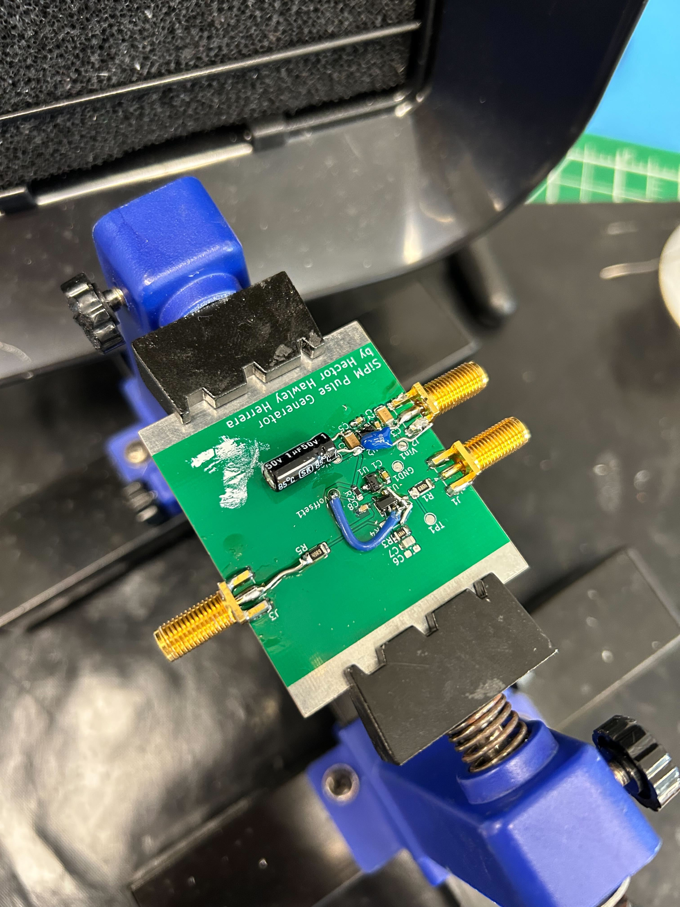

# Charge Injector

The amplifier used in my setup could not be calibrated using a sine wave as the gain parameter was a wide-band gain (from few kHz to 200 MHz). Ideally, this gain can be calculated when the amplifier is injected with a pulse with a known total integrated charge. The total charge can be estimated with the next equation

$Q = \Delta V C$

This charge injector (or whatever is the official technical name, I could never find it!) was built with the most accurate capacitor I could buy which is a  9.1 pF, $C$, 0.5% NP0 resistor. This circuit needs a high precision (in voltage) square square to work. I made mine with a 10V precision voltage reference, a 10:1 voltage divider (for a 1Vpp square wave), and a signal relay.

The main contributor to the error budget comes from $C$ and everything else contributed almost nothing.

However, the final design was a "failure". Problems such as not enough filtering of the power rails (which was solved with enough hand-soldered capacitors: see the picture!) and the noise mostly dominated at low frequency  (1-10 kHz) made this design not really suitable for the application.

It was a good project built and tested within 2-3 weeks.

